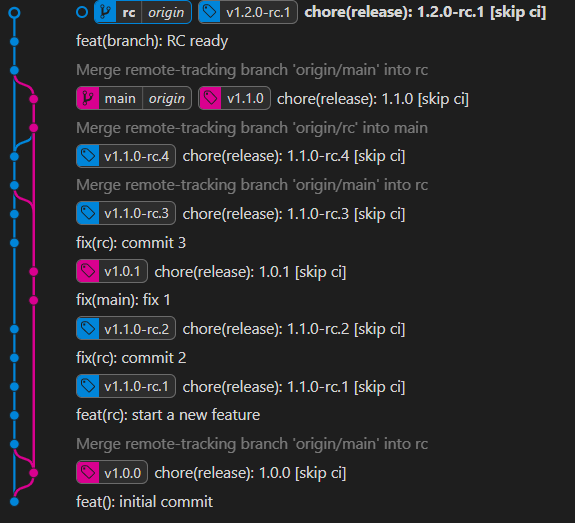

# Things to remember

* **Don't** use merge commit except for cutting releases
* **Don't** merge `main` or `rc` branches to PR or local branches
* **Always** rebase PR or local branches
# Cutting a release

## Visual




* first checkout `rc` ensure it is up to date.
* then merge `origin/main` to `rc`

```zsh
    git fetch
    git rebase
    git merge origin/main --no-ff
    ... resolve conflicts
    git push
```
You will have merge conflicts, please resolve them. Some guidance for the following files
   
* `CHANGELOG.md` -> accept all incoming changes
* `package.json` -> accept incoming changes for version entry

**After resolving merge conflicts, Push changes to the origin and ensure the `rc` branch builds properly, any test passes, and/or any validation.**


### Once the RC branch is validated

* checkout `main`, ensure it is up to date.
* then merge `origin/rc` to `main`

```zsh
    git fetch
    git rebase
    git merge origin/rc --no-ff
    ... resolve conflicts
    git push
```
**You may have merge conflicts. Resolve them and push changes to origin.**


## Get the `rc` branch ready for the next development

* New version is available on the main branch
* checkout `rc`, and ensure it is up to date.
* then merge `origin/main` to `rc`

```zsh
    git fetch
    git rebase
    git merge origin/main --no-ff
    ... resolve conflicts
    ... add a dummy feature commit
    git push
```
You will have merge conflicts, please resolve them. Some guidance for the following files
   
* `CHANGELOG.md` -> accept all incoming changes
* `package.json` -> accept all incoming changes
* Add a dummy feature commit
* push changes to origin
